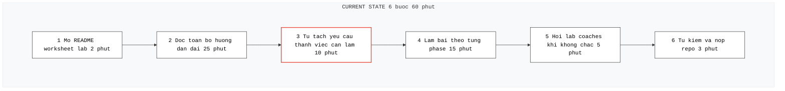
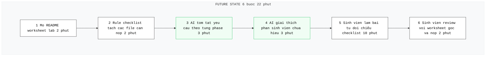

# 02 — Group Problem Statement


> Nhóm chọn candidate problem: **Khó hiểu yêu cầu lab**
>
> Lý do chọn: Pain thật trong lab, có evidence từ lab coaches, workflow rõ, metric dễ đo, phù hợp so sánh Rule/Workflow/Agent


---


## Group convergence


Nhóm 3-4 người, mỗi người share top 3. Tổng cộng khoảng 9-12 candidates.


### Candidates table


| # | Problem | Lý do chọn | Điều còn chưa chắc |
|---|---------|-----------|-------------------|
| 1 | Meeting/team discussion bị miss thông tin | Pain thật trong teamwork, AI phù hợp để summarize + extract action item | Accuracy khi nhiều người nói cùng lúc |
| 2 | Unified search cho tài liệu/lịch/link | Workflow hằng ngày, impact rộng cho học viên/team | Data integration nhiều nguồn |
| 3 | Customize CV cho từng job | Scope rõ, metric dễ đo, sát nhu cầu cá nhân | Quality/relevance với recruiter |
| 4 | Khó hiểu yêu cầu lab | Workflow rõ, nhiều sinh viên gặp, có thể đo bằng số lần hỏi lại hoặc số lỗi nộp thiếu | Cần xác định thế nào là "hiểu đúng yêu cầu lab" và đo bằng metric nào |
| 5 | Người học hỏi cùng một lỗi API/test | Pain lặp lại, actor rõ, có thể giảm thời gian debug và giảm số lần hỏi lab coaches | Cần phân biệt lỗi nào AI xử lý tốt, lỗi nào vẫn cần coach hỗ trợ |
| 6 | Thông báo bị phân tán trên nhiều kênh | Nhiều người đau vì thông tin phân tán, impact rộng cho cả sinh viên và lab coaches | cần xác định kênh nào là nguồn chính thức |
| 7 | Gặp khó khi đọc papers | Workflow rõ nhất, metric rõ, pain thật, có thể so sánh nhiều mức AI, có thể validate nhanh với sinh viên khác | "Hiểu ab-xy%" đo thế nào chính xác? Baseline là gì? |
| 8 | Hiểu công thức toán học trong papers | Workflow lookup notation cụ thể, impact rõ, có thể so sánh Rule/Workflow/Agent | Có công cụ nào đủ tốt chưa? Có phải chỉ là lookup nhanh? |
| 9 | Debug thuật toán từ paper | Workflow search → read → test rất rõ, metric thời gian đo được, có thể so sánh nhiều mức AI | Có phải implementation task hay research task? Scope có quá rộng? |


### Cluster


| Cluster | Candidate examples | Pattern chung |
|---------|-------------------|---------------|
| **Quản lý & Trích xuất thông tin** | Meeting/team discussion bị miss thông tin; Unified search cho tài liệu/lịch/link; Thông báo bị phân tán trên nhiều kênh | Người dùng cần tìm lại thông tin quan trọng nhưng dữ liệu nằm rải rác ở nhiều nguồn như meeting, chat, tài liệu, lịch, link hoặc kênh thông báo |
| **Hỗ trợ học tập** | Khó hiểu yêu cầu lab; Người học hỏi cùng một lỗi API/test; Debug thuật toán từ paper | Workflow rõ, nhiều sinh viên gặp, có thể đo bằng số lần hỏi lại hoặc số lỗi nộp thiếu; Sinh viên gặp khó trong quá trình làm lab: không hiểu rõ yêu cầu, đọc thiếu bước, gặp lỗi lặp lại và phải hỏi lab coaches |
| **Research & Paper Understanding** | Gặp khó khi đọc papers; Hiểu công thức toán học trong papers | Người học/researcher mất nhiều thời gian để hiểu methodology, notation và technical detail trong paper AI/ML |
| **Career & Application Workflow** | Customize CV cho từng job | Người dùng phải điều chỉnh nội dung cá nhân theo nhiều context khác nhau (JD, recruiter expectation, role requirement) |


### Shortlist và score


| Candidate | Actor rõ | Workflow rõ | Pain có evidence | Impact đo được | Làm trong lab | So sánh R/W/A được | Nhóm hiểu domain | Tổng |
|-----------|---------:|-----------:|----------------:|---------------:|--------------:|------------------:|----------------:|-----:|
| Khó hiểu yêu cầu lab | 5 | 5 | 5 | 4 | 5 | 5 | 5 | **34** |
| Thông báo bị phân tán trên nhiều kênh | 5 | 4 | 5 | 3 | 3 | 5 | 4 | 29 |
| Hiểu công thức toán học trong papers | 4 | 4 | 4 | 3 | 4 | 4 | 4 | 27 |


### Nhóm chọn:


```text
Khó hiểu yêu cầu lab
```


### Vì sao chọn:


- Đang ở môi trường làm việc với lab, có sẵn bộ đề và các lỗi sai/thiếu sót của học viên để làm dữ liệu
- Pain-point có bằng chứng thực tế: Có evidence rõ ràng từ việc Lab coaches phải trả lời lặp đi lặp lại cùng một câu hỏi. AI có thể đóng vai trò "First-line Support" cực kỳ hiệu quả ở đây.
- Metric đo lường khách quan: Có thể đo lường trực tiếp bằng "Số lần hỏi lại coach" hoặc "Tỷ lệ lỗi nộp thiếu (Missing items)" của học viên trong các lab.
- Phù hợp để so sánh R/W/A: Dễ dàng thiết kế các cấp độ từ Rule-based (check list), Workflow (step-by-step guidance) đến Agent (giải đáp thắc mắc dựa trên ngữ cảnh đề bài).


### Vì sao không chọn các bài khác:


**Thông báo bị phân tán trên nhiều kênh:**
- Khó khăn trong việc tích hợp API từ nhiều nguồn (Slack, Discord, Email, Lịch) và vấn đề bảo mật dữ liệu cá nhân.
- Khó xác định "Sự thật": Khó định nghĩa đâu là kênh thông tin chính thống để AI ưu tiên khi có sự mâu thuẫn giữa các kênh.


**Hiểu công thức toán học trong papers:**
- Chủ yếu phục vụ nhóm Researcher, impact không rộng bằng việc hỗ trợ học tập cho toàn bộ sinh viên trong Lab.
- Độ khó kỹ thuật: Việc OCR các kí hiệu toán học từ pdf vẫn là 1 bài toán lớn


---


## Quick validation


Khảo sát các câu trả lời của học viên và lab coaches cho thấy:


| Nguồn | Số người | Tín hiệu xác nhận | Tín hiệu phản bác | Nhóm sửa problem thế nào |
|-------|---------:|------------------|------------------|-------------------------|
| Discord / lab chat observation | ~40 câu hỏi được review | Nhiều câu hỏi lặp lại như: "nộp file nào?", "API key lấy ở đâu?", "submit format thế nào?" | Một số câu hỏi đến từ việc học viên không đọc kỹ đề | Thu hẹp scope: không thay thế việc đọc đề, mà hỗ trợ clarify requirement và checklist |
| Quick interview với lab coaches | 3 | 3/3 coaches xác nhận phải trả lời lặp lại cùng một nhóm câu hỏi mỗi lab | Một số lỗi cần coach xem code trực tiếp mới xử lý được | Giới hạn AI ở mức "first-line support", không debug toàn bộ project |
| Mini poll trong lớp | 8 | 6/8 từng hỏi lại submit requirement | Một số học viên nói chỉ cần checklist/manual | Thêm non-AI alternative: checklist + template submit |


### Insight sau validation:


```text
Pain thật không nằm ở việc "lấy số" đơn thuần. Pain nằm ở đoạn biến nhiều nguồn rời rạc thành narrative đủ rõ cho người khác ra quyết định.
```


---


## Research giải pháp


Nhóm tìm các hướng đã có sẵn, không giả định phải tự build từ đầu.


| Nguồn / tool / case | Link | Họ giải quyết phần nào? | Điểm mạnh | Khoảng trống / rủi ro | Bài học cho nhóm |
|---------------------|------|------------------------|-----------|----------------------|------------------|
| Github Markdown Checklist | https://docs.github.com/en/get-started/writing-on-github/working-with-advanced-formatting/about-task-lists | Biến yêu cầu thành checklist có thể tick | Đơn giản, dễ áp dụng, không cần AI | Không giải thích được yêu cầu khó hiểu; vẫn cần người viết checklist thủ công | Checklist là baseline non-AI tốt, nên dùng cho phần nộp bài |
| Notion AI | https://www.notion.com/product/ai | Tóm tắt tài liệu, viết lại nội dung, tạo action items | Hữu ích khi tài liệu dài và cần rút gọn | Cần kiểm tra lại với tài liệu gốc, có thể tóm tắt thiếu chi tiết | AI nên hỗ trợ summarize/checklist, không thay người học |
| ChatGPT / Claude / Gemini | https://chatgpt.com/ | Giải thích tài liệu dài, chuyển yêu cầu thành steps/checklist, hỏi đáp theo ngữ cảnh | Linh hoạt, phù hợp với lab dài nhiều phase | Có thể hallucinate hoặc bỏ sót yêu cầu nếu prompt/input thiếu | Cần yêu cầu AI trích lại checklist và cảnh báo |
| LMS / Course Platform Checklist | https://moodle.org/ | Tổ chức bài học, deadline, tài liệu và submission | Có cấu trúc rõ, phù hợp quản lý khóa học | Không tự giải thích yêu cầu theo từng người học; phụ thuộc cách instructor setup | Nên kết hợp checklist chính thức + AI giải thích phần khó |


### Research takeaway:


```text
Không nên build một agent tự làm bài hoặc tự quyết định nội dung nộp thay sinh viên. Hướng hợp lý hơn là Workflow: dùng checklist/rule để tách yêu cầu cố định, dùng AI để giải thích các phần dài hoặc mơ hồ, sau đó sinh viên tự kiểm tra lại với worksheet gốc trước khi nộp.
```


---


## Workflow before/after


File nhóm nộp kèm:


```text
02-group-problem-statement-workflow.png
```


Nội dung workflow:


### CURRENT STATE — 6 bước, 60 phút


```text
[1 Mở README/worksheet lab: 2']
→ [2 Đọc toàn bộ hướng dẫn dài: 25']
→ [3 Tự tách yêu cầu thành việc cần làm: 10'] <-- bottleneck
→ [4 Làm bài theo từng phase: 15']
→ [5 Hỏi lab coaches khi không chắc: 5']
→ [6 Tự kiểm và nộp repo: 3']
```





### FUTURE STATE — 6 bước, 22 phút


```text
[1 Mở README/worksheet lab: 2']
→ [2 Rule/checklist tách các file cần nộp: 2'] -- Rule/checklist
→ [3 AI tóm tắt yêu cầu theo từng phase: 3'] -- Workflow step
→ [4 AI giải thích phần sinh viên chưa hiểu: 3'] -- Workflow step
→ [5 Sinh viên làm bài + tự đối chiếu checklist: 10'] -- Human boundary
→ [6 Sinh viên review với worksheet gốc và nộp: 2']
```





### Fallback:


Nếu AI tóm tắt sai, thiếu yêu cầu hoặc đưa ra hướng dẫn không khớp worksheet gốc, sinh viên phải quay lại đọc worksheet gốc và dùng checklist chính thức trước khi nộp. AI không được coi là nguồn cuối cùng.


### Bottleneck mới:


Bottleneck mới là bước sinh viên tự đối chiếu checklist và worksheet gốc. Đây là bottleneck chấp nhận được vì đó là điểm kiểm soát chất lượng trước khi nộp.


### Before/after impact:


| Metric | Trước | Sau kỳ vọng | Ghi chú |
|--------|------:|-----------:|---------|
| Tổng thời gian | 40 phút | Dưới 25 phút | Target chính |
| Số bước | 6 | 6 | Không giảm nhiều bước, nhưng giảm effort ở bước đọc hiểu |
| Bước thủ công | 6/6 | 2/6 | Sinh viên vẫn làm bài và review |
| Bottleneck chính | Tự đọc và tách yêu cầu | Tự đối chiếu checklist | Human boundary |
| Risk mới | Đọc thiếu do người học | AI tóm tắt sai hoặc bỏ sót yêu cầu | Cần đối chiếu worksheet gốc |


---


## Problem Statement v0


| Field | Nội dung |
|-------|----------|
| **Actor** | Sinh viên mới học và đang làm lab cá nhân và cần nộp bài đúng yêu cầu. |
| **Workflow** | Sinh viên mở worksheet/README, đọc hướng dẫn dài, tự tách các việc cần làm, làm bài, hỏi lab coaches nếu không chắc, tự kiểm tra và nộp repo |
| **Bottleneck** | Bước đọc hiểu và tự tách yêu cầu thành checklist mất nhiều thời gian, dễ bỏ sót file cần nộp hoặc hiểu sai yêu cầu. |
| **Impact** | Sinh viên mất khoảng 40 phút để hiểu yêu cầu; một số bạn hỏi lại lab coaches hoặc nộp thiếu phần; coaches phải trả lời các câu hỏi lặp lại. |
| **Success Metric** | Giảm thời gian hiểu yêu cầu từ 40 phút xuống dưới 25 phút; giảm số lỗi nộp thiếu file hoặc thiếu field; giảm số lần hỏi lại coaches về yêu cầu lab. |
| **Boundary** | AI không làm bài thay sinh viên, không thay đổi yêu cầu gốc, không được coi là nguồn cuối cùng; sinh viên phải đối chiếu lại với worksheet trước khi nộp. |


---


## Rule / Workflow / Agent


| Mức | Phương án cho bài toán nhóm | Khi nào đủ | Rủi ro | Chọn? |
|------|---------------------------|------------|-------|-------|
| **Rule** | Tạo checklist cố định từ worksheet: file cần nộp, phase cần hoàn thành, self-check cuối bài | Đủ nếu vấn đề chỉ là sinh viên quên file hoặc thiếu bước nộp bài | Không giải thích được phần mơ hồ; không trả lời được câu hỏi theo ngữ cảnh | Không chọn làm toàn bộ, nhưng dùng cho checklist |
| **Workflow** | Checklist cố định → AI tóm tắt từng phase → AI giải thích phần khó hiểu → sinh viên làm bài → sinh viên đối chiếu worksheet gốc | Hợp vì workflow tuyến tính, input rõ là worksheet, AI chỉ hỗ trợ đọc hiểu và self-check | AI có thể tóm tắt thiếu hoặc hiểu sai yêu cầu; cần sinh viên review | **Chọn** |
| **Agent** | Agent tự đọc worksheet, theo dõi tiến độ, hỏi sinh viên, kiểm repo, gợi ý sửa và quyết định bước tiếp theo | Chỉ cần nếu hệ thống phải tự lập kế hoạch nhiều bước, đọc repo thật và theo dõi tiến độ động | Quá rộng cho lab, rủi ro làm thay sinh viên hoặc đưa hướng dẫn sai | Chưa chọn |


### Mức chọn:


```text
Workflow.
```


### Vì sao chọn:


- Bài toán không cần agent tự lập kế hoạch phức tạp.
- Các bước khá rõ: đọc worksheet, tách checklist, giải thích yêu cầu, sinh viên làm bài, rồi self-check.
- Rule/checklist đủ cho phần yêu cầu cố định, còn AI hữu ích ở bước giải thích nội dung dài hoặc mơ hồ.
- Sinh viên vẫn là người quyết định nội dung bài làm và phải kiểm tra lại trước khi nộp.


### Vì sao không chọn mức đơn giản hơn:


- Rule-only giải quyết được phần checklist nhưng không giải thích được yêu cầu mơ hồ hoặc dài.
- Sinh viên vẫn phải đọc worksheet và tự hiểu phần context, điều này vẫn gây pain.


---


## Problem Statement v1


| Field | Nội dung |
|-------|----------|
| **Actor** | Sinh viên mới học và đang làm lab cá nhân theo worksheet dài nhiều phase. |
| **Workflow** | Mở worksheet → đọc yêu cầu → tách checklist cần làm/nộp → làm từng phase → hỏi coach nếu không chắc → self-check → nộp repo. |
| **Bottleneck** | Bước đọc hiểu và tách yêu cầu thành checklist mất nhiều thời gian, dễ bỏ sót yêu cầu hoặc hiểu sai phần cần nộp. |
| **Impact** | Khoảng 40 phút để hiểu yêu cầu và chuẩn bị làm bài; sinh viên hỏi lại coaches nhiều lần; có rủi ro nộp thiếu file hoặc thiếu nội dung. |
| **Success Metric** | Giảm thời gian hiểu yêu cầu xuống dưới 25 phút; giảm số lần hỏi lại về yêu cầu lab; giảm lỗi nộp thiếu file/thiếu field. |
| **Boundary** | AI không làm bài thay sinh viên, không thay worksheet gốc, không tự quyết định bài đã đủ; sinh viên phải review với checklist và worksheet trước khi nộp. |
| **AI intervention point** | Sau khi sinh viên có worksheet/README lab, trước khi bắt đầu làm bài và trước bước self-check cuối cùng. |
| **Mức chọn** | Workflow: checklist/rule tách yêu cầu cố định, AI giải thích từng phase, sinh viên tự làm và review. |
| **Rủi ro & người thật kiểm tra** | Risk: AI tóm tắt thiếu, hiểu sai yêu cầu, hoặc làm sinh viên phụ thuộc. Người thật kiểm tra: sinh viên đối chiếu worksheet gốc; lab coach xác nhận nếu có mâu thuẫn. |


---


## Final decision


| Câu hỏi | Yes / Not Yet / No | Ghi chú |
|---------|-------------------|---------|
| Actor và workflow đã rõ chưa? | Yes | Sinh viên làm lab theo worksheet |
| Baseline và success metric đã đo được chưa? | Yes | 40 phút → dưới 25 phút |
| Có data/input đủ dùng chưa? | Yes | Có worksheet/README làm input |
| Nếu AI sai, hậu quả có chấp nhận được không? | Yes | Sinh viên review lại với worksheet gốc |
| Có người review/owner vận hành không? | Yes | Sinh viên tự review + lab coach |
| Có cách non-AI đơn giản hơn không? | Yes | Checklist thủ công + FAQ |


### Decision:


```text
Go với scope nhỏ.
```


### Pilot nhỏ nhất:


```text
Dùng một worksheet lab thật.
Tạo checklist các file cần nộp và các phase cần hoàn thành.
Cho 3-5 sinh viên dùng workflow:
1. Đọc checklist/tóm tắt bằng AI.
2. Hỏi AI các phần chưa hiểu.
3. Làm bài.
4. Self-check bằng checklist.
5. Đối chiếu lại worksheet gốc trước khi nộp.
```


### Đo:


- Thời gian từ lúc mở worksheet đến lúc hiểu được cần làm gì.
- Số câu hỏi phải hỏi coach.
- Số lỗi nộp thiếu file hoặc thiếu field.
- Mức độ tự tin của sinh viên trước khi nộp.


### Exit / rollback:


```text
Nếu AI tóm tắt sai yêu cầu quan trọng hoặc sinh viên vẫn phải đọc lại toàn bộ worksheet như ban đầu, hạ xuống phương án checklist thủ công + FAQ.


Nếu AI khiến sinh viên phụ thuộc và không tự hiểu bài, giới hạn AI chỉ được dùng cho self-check và giải thích thuật ngữ, không được gợi ý nội dung làm bài.


Nếu số lỗi nộp thiếu không giảm sau pilot, cần viết lại checklist hoặc xác định lại bottleneck thật.
```


### Decision rationale:


```text
Problem rõ, actor rõ và workflow có thể vẽ được. Bottleneck nằm ở bước đọc hiểu và tách yêu cầu thành checklist. Có thể đo bằng thời gian hiểu yêu cầu, số lần hỏi lại và số lỗi nộp thiếu. Có non-AI component là checklist/rule. AI chỉ can thiệp vào bước giải thích và tóm tắt, không làm bài thay sinh viên. Human boundary rõ: sinh viên vẫn phải tự làm bài và đối chiếu worksheet gốc trước khi nộp.
```